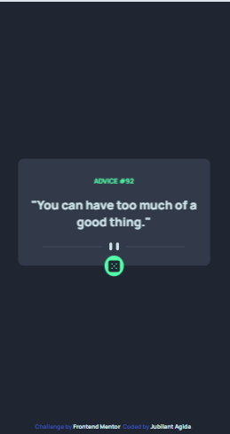

# Frontend Mentor - Advice generator app solution

This is a solution to the [Advice generator app challenge on Frontend Mentor](https://www.frontendmentor.io/challenges/advice-generator-app-QdUG-13db). Frontend Mentor challenges help you improve your coding skills by building realistic projects.

## Table of contents

- [Overview](#overview)
  - [The challenge](#the-challenge)
  - [Screenshot](#screenshot)
  - [Links](#links)
- [My process](#my-process)
  - [Built with](#built-with)
  - [What I learned](#what-i-learned)
  - [Continued development](#continued-development)
- [Author](#author)

## Overview

### The challenge

Users should be able to:

- View the optimal layout for the app depending on their device's screen size
- See hover states for all interactive elements on the page
- Generate a new piece of advice by clicking the dice icon

### Screenshot




### Links

- Solution URL: [solution URL here](https://www.frontendmentor.io/solutions/css-grid-fetch-api-6OAHlUXKPz)
- Live Site URL: [ live site URL here](https://advice-generator-seven-blush.vercel.app/)

## My process

### Built with

- Semantic HTML5 markup
- CSS custom properties
- CSS Grid

### What I learned

The major reason for my undertaking of this praticular project is to brush up my knowledge on the javascript fetch API as shown below. I learnt another way to get this done by using AsynsJS.


```js
const renderSlips = () => {

    fetch('https://api.adviceslip.com/advice')
        .then(resp => resp.json())
        .then(data => {
            const slip = data.slip;
            header.innerText = `ADVICE ${' '} #${slip.id}`;
            advice.innerText = `"${slip.advice}"`;
            // This code fetches data from the advice slip API
        });
}
```

If you want more help with writing markdown, we'd recommend checking out [The Markdown Guide](https://www.markdownguide.org/) to learn more.

### Continued development

I plan to add other features on this project in time to come. Features like adding a favorite section to save user's favorite advice slips.


## Author

- Frontend Mentor - [@SirJubilant](https://www.frontendmentor.io/profile/SirJubilant)
- Twitter - [@jubilant_agida](https://www.twitter.com/jubilant_agida)